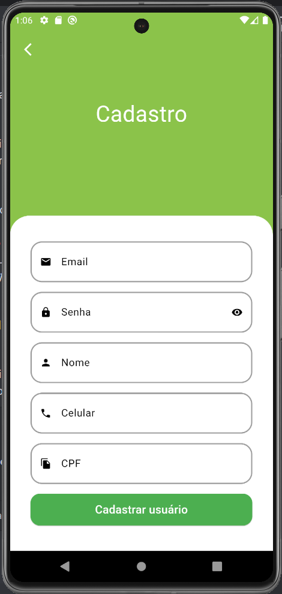

# Green Grocer

O Green Grocer é um aplicativo desenvolvido com Flutter e GetX para gerenciamento de estado.

## Screenshots

      

## GIF de Demonstração

## Bibliotecas Utilizadas

- **animated_text_kit**: Animações de texto personalizadas para melhorar a interface do usuário.
- **mask_text_input_formatter**: Formatação de entrada de texto, como máscaras para campos de formulário.
- **intl**: Internacionalização e formatação de datas e números.
- **add_to_cart_animation**: Animação para adicionar itens ao carrinho de compras.
- **fluttertoast**: Exibição de mensagens toast para notificações rápidas.
- **shimmer**: Efeitos shimmer para exibir carregamento de conteúdo de forma visualmente atraente.
- **getx**: Gerenciamento de estado reativo, rotas e dependências.